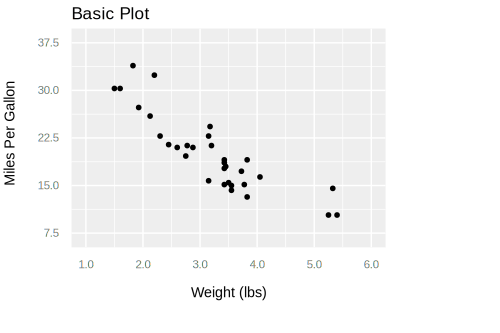
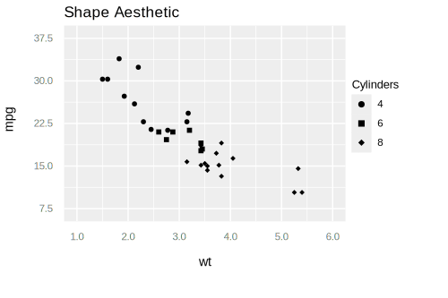
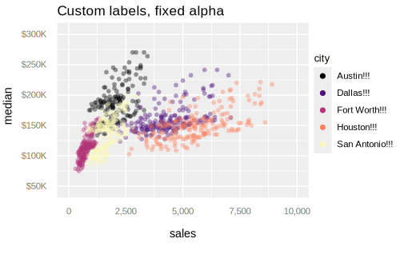
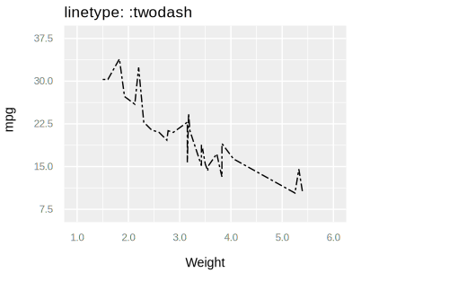

# GGity

GGity is a charting library intended to bring the familiar interface of R's ggplot2 library to the task of drawing SVG plots with Elixir.

## Examples

A GGity plot is constructed from data, a geom (such as points or lines, to which GGity is limited at this time) and a mapping of aesthetics (x, y, color, size, etc.) to variables in the data.

Data must be provided as a list of maps, where each map is an observation, and the map's keys are the names of the variables observed.

The mapping is specified with a map containing key-value pairs of variable names and aesthetics. Mappings must be provided for the x and y aesthetics; other aesthetics are optional, with fixed default values applied if a mapping is not specified. See the documentation for supported aesthetics for each geom.

```elixir
    Examples.mtcars()
    |> Plot.new(%{x: :wt, y: :mpg})
    |> Plot.labs(title: "Basic Plot", x: "Weight (lbs)", y: "Miles Per Gallon")
    |> Plot.geom_point()
    |> Plot.plot()
```



Note that the library includes a few of R's canonical datasets, which are used in these examples and available to support development as described further below.

Mappings can also be specified when a geom is added:

```elixir
    Examples.mtcars()
    |> Plot.new(%{x: :wt, y: :mpg})
    |> Plot.geom_point(%{shape: :cyl})
    |> Plot.labs(title: "Shape Aesthetic", shape: "Cylinders")
    |> Plot.plot()
```



Legends are currently only supported for discrete scales.

Aesthetics can be assigned a fixed value (not tied to a variable), and both legend
and axis labels support custom formatting.

```elixir
    Examples.tx_housing()
    |> Enum.filter(fn record ->
      record["city"] in ["Houston", "Fort Worth", "San Antonio", "Dallas", "Austin"]
    end)
    |> Plot.new(%{x: "sales", y: "median"})
    |> Plot.labs(title: "Custom labels, fixed alpha")
    |> Plot.geom_point(%{color: "city"}, alpha: 0.4)
    |> Plot.scale_x_continuous(labels: :commas)
    |> Plot.scale_y_continuous(labels: fn value -> "$#{Labels.commas(round(value / 1000))}K" end)
    |> Plot.scale_color_viridis(option: :magma, labels: fn value -> "#{value}!!!" end)
    |> Plot.plot()
```



The table below illustrates which scales are available for different aesthetics.

| Aesthetic | Continuous | Discrete | Identity | Date/DateTime |
| :-------: | :--------: | :------: | :------: | :-----------: |
| x | Yes | No | Yes | Yes |
| y | Yes | No | Yes | No |
| alpha | Yes | Yes | Yes | No |
| color | No | Yes | Yes | No |
| shape | No | Yes | Yes | No |
| size | Yes | Yes | Yes | No |

Line geoms also support setting a custom value for line type.

```elixir
    Examples.mtcars()
    |> Plot.new(%{x: :wt, y: :mpg})
    |> Plot.labs(title: "linetype: :twodash", x: "Weight")
    |> Plot.geom_line(linetype: :twodash, size: 1)
    |> Plot.plot()
```



## Goals
I am interested in data visualization and after learning a lot from the work being done on [ContEx](https://github.com/mindok/contex), I decided that starting to write a basic clone of ggplot2 would help me learn more about the grammar of graphics, ggplot2 and how to develop a reasonably nontrivial library for Elixir.

## Non-Goals
* Meet a real-world need - I code as a hobby, so this is not the product of a real-world use case. There are probably edge cases unaddressed  and validations that should be happening but are not. I'm open to addressing these things; they just might not pop up unless someone else finds a problem.

* Optimize for LiveView - there is no reason this library could not be used with LiveView, especially with small datasets, but adding features or optimizations specifically for that purpose are not at the top of my own priority list (I do have some ideas).

* Optimize for performance generally - I am not trying to make it slow! At the same time I am not using this in the real world, so performance is not as important or apparent to me. I am more interested in adding features than squeezing out performance gains.

With that said, I would welcome and do my best to respond promptly to PRs for the items above; just noting here that I will not be starting to work on them myself soon.

## Alternatives

[ContEx](https://github.com/mindok/contex) - built with LiveView in mind, actually being used, supports bar charts, Gantt charts and (very cool) sparklines. It is also guided by grammar of graphics concepts but is not as dogmatic about it as this library will be.

[Plotex](https://github.com/elcritch/plotex) - focused on time series. Dates/times are hard, and while I have not looked at it in detail I bet Plotex does them better than GGity.

## Development

### Roadmap

GGity has a roadmap which is subject to change based on what is interesting to me, how difficult those items turn out to be to implement and issues/ideas/contribution from others. If I get to version 0.2 I will think about publishing to Hex.

### Visual tests
GGity has decent unit test coverage, but given the domain, a picture is worth a thousand words. Therefore the library includes some mix tasks that generate plots of the included datasets to support development. I have used them on Ubuntu Linux and WSL on Windows.

Linux examples:

```bash
mix ggity.visual.geom.point
# Generates a file with point geom examples and opens in Firefox. 

mix ggity.visual.geom.line google-chrome
# Generates a file with line geom examples and opens in Chrome. 
# Any browser can be specified using the binary name that would launch it
# from the terminal; Firefox is the default if nothing is specified.

mix ggity.visual
# Generates all of the example files and opens them in Firefox.
# Each file is opened in sequence and the next file launches when
# the preceding browser instance is closed.
```

WSL example:

```bash
mix ggity.visual.geom.point --wsl
# The --wsl option works for WSL users by generating a file with
# point geom examples and opening the file in Firefox in Windows
# assuming Firefox is installed in the default location.
# This fails if an instance of Firefox is already open in Windows.
# The --wsl option doesn't support other browsers on Windows at this time.
```

### Other checks

The library also includes an alias (```mix checks```) that runs Credo, Dialyzer, the visual tests and formatter in sequence. I prefer to have all of those things in order before committing a change.

## Acknowledgements

I am very grateful to @mindok, the author of ContEx, who graciously accepted and provided feedback on contributions to that library, which in turn inspired me to write this (and flat out copy some a few parts of ContEx in so doing). I do not view GGity as a replacement for ContEx; it is a personal opportunity for me to learn a lot at my own pace. I made it public in case it might be helpful to others as an example.

Acknowledgement is also due to Hadley Wickham and others who have built [ggplot2](https://ggplot2.tidyverse.org/); the library is great, but Wickham's grammar of graphics is really an excellent piece of academic work in its own right. Along with Edward Tufte's book I think it is safe to say a golden age of visualization ensued.

## Installation

The package can be installed from GitHub by adding `ggity` to your list of dependencies in `mix.exs`:

```elixir
def deps do
  [
    {:ggity, git: "https://github.com/srowley/ggity.git", tag: "v0.1"}
  ]
end
```

GGity requires Elixir 1.10, and will likely require Elixir 1.11 shortly after that version is released, due to the nice improvements in each version associated with handling dates and datetimes.

Documentation can be generated with [ExDoc](https://github.com/elixir-lang/ex_doc).