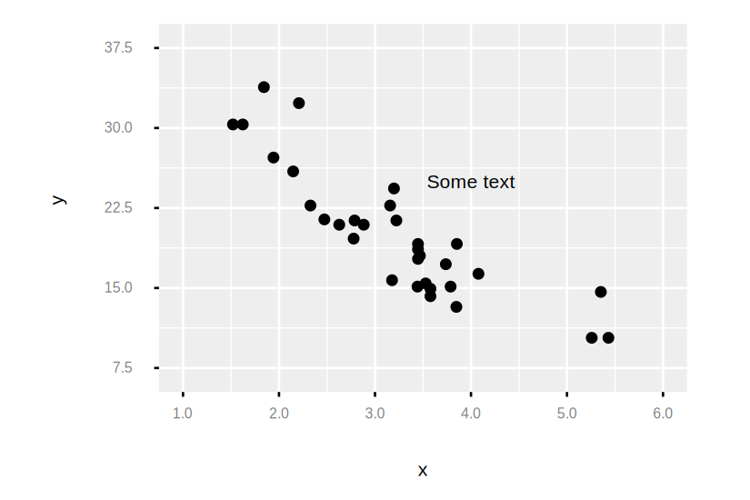
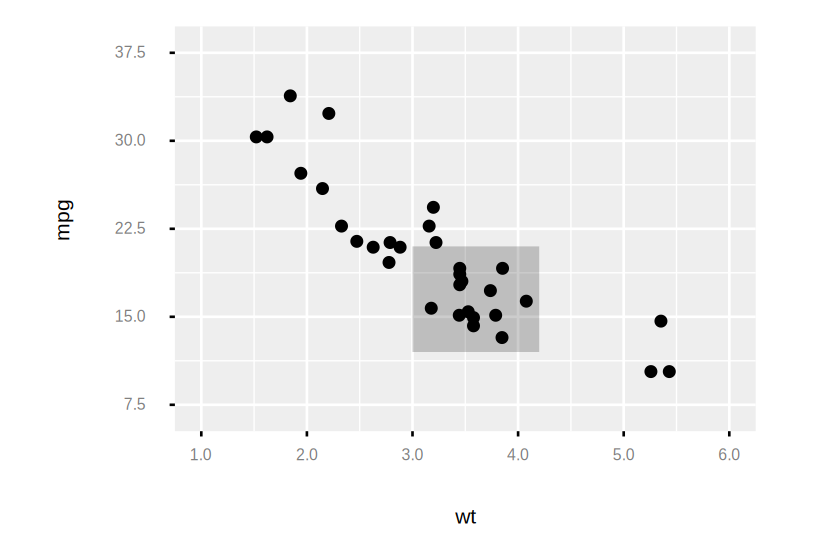
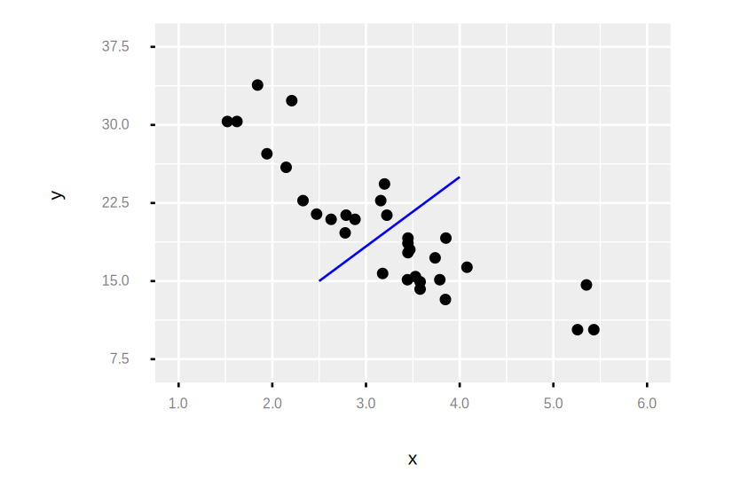

```
Examples.mtcars()
|> Plot.new(%{x: :wt, y: :mpg})
|> Plot.geom_point()
|> Plot.annotate(:text, x: 4, y: 25, label: "Some text")
|> Plot.plot()

```

```
Examples.mtcars()
|> Plot.new(%{x: :wt, y: :mpg})
|> Plot.geom_point()
|> Plot.annotate(:rect, xmin: 3, xmax: 4.2, ymin: 12, ymax: 21, alpha: 0.2)
|> Plot.plot()

```

```
Examples.mtcars()
|> Plot.new(%{x: :wt, y: :mpg})
|> Plot.geom_point()
|> Plot.annotate(:segment, x: 2.5, xend: 4, y: 15, yend: 25, color: "blue")
|> Plot.plot()

```

