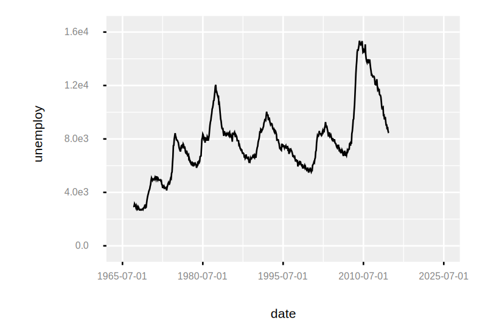
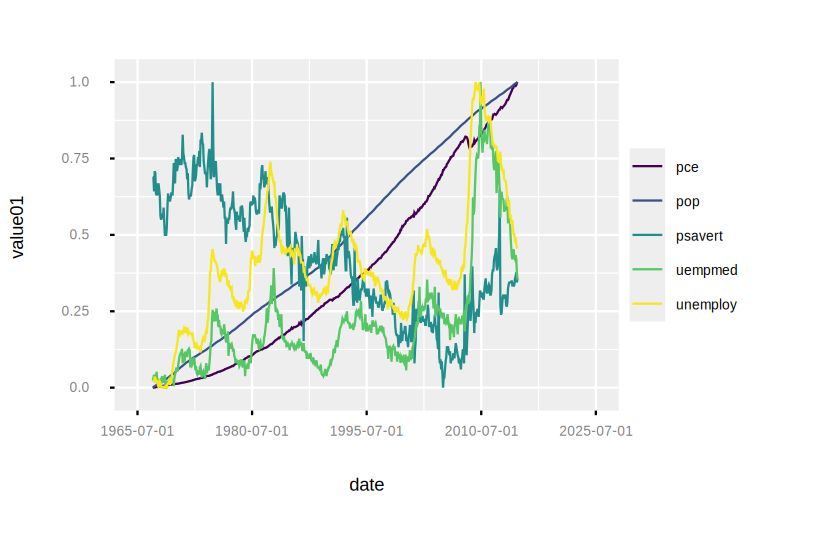
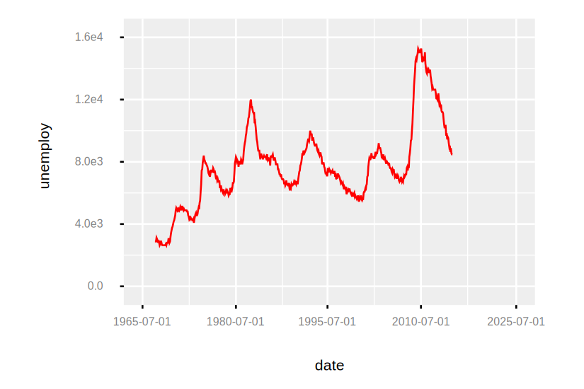

```
Examples.economics()
|> Plot.new(%{x: "date", y: "unemploy"})
|> Plot.geom_line()
|> Plot.plot()

```

```
Examples.economics_long()
|> Plot.new(%{x: "date", y: "value01", color: "variable"})
|> Plot.geom_line()
|> Plot.plot()

```

```
Examples.economics()
|> Plot.new(%{x: "date", y: "unemploy"})
|> Plot.geom_line(color: "red")
|> Plot.plot()

```

