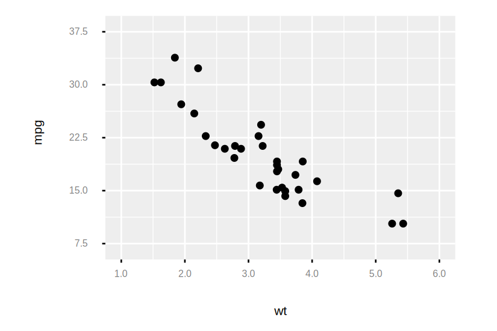
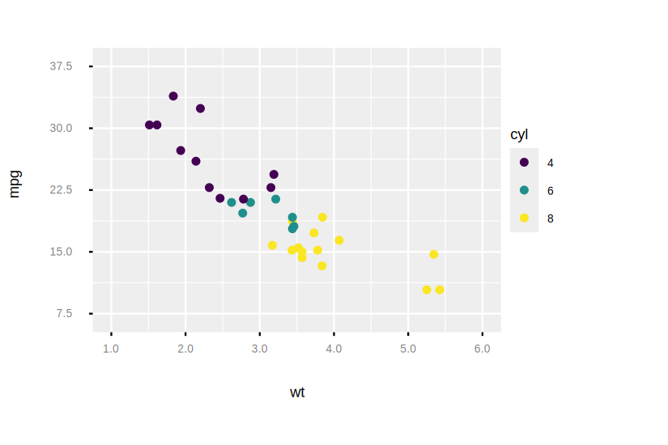
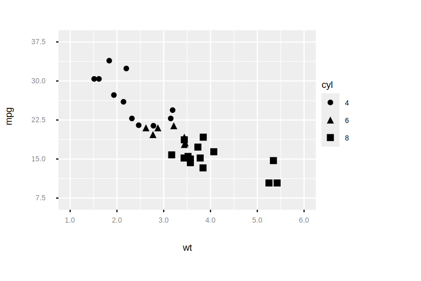
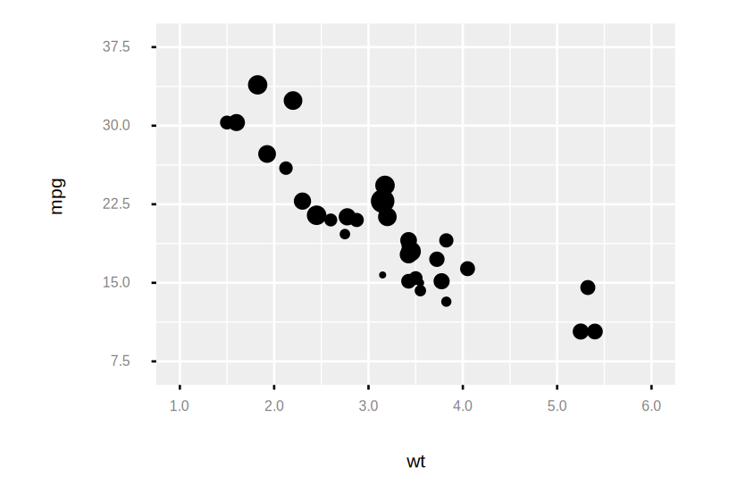
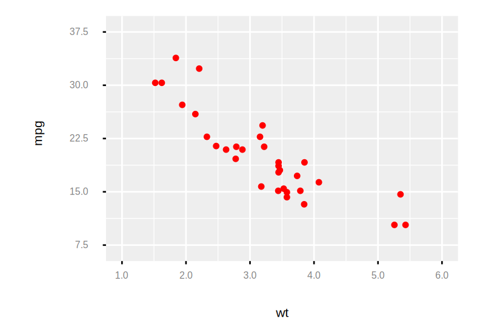

```
Examples.mtcars()
|> Plot.new(%{x: :wt, y: :mpg})
|> Plot.geom_point()
|> Plot.plot()

```

```
# Add aesthetic mapping to color
Examples.mtcars()
|> Plot.new(%{x: :wt, y: :mpg})
|> Plot.geom_point(%{color: :cyl})
|> Plot.plot()

```

```
# Add aesthetic mapping to shape
Examples.mtcars()
|> Plot.new(%{x: :wt, y: :mpg})
|> Plot.geom_point(%{shape: :cyl})
|> Plot.plot()

```

```
# Add aesthetic mapping to size (for circles, a bubble chart)
Examples.mtcars()
|> Plot.new(%{x: :wt, y: :mpg})
|> Plot.geom_point(%{size: :qsec})
|> Plot.plot()

```

```
# Set aesthetics to fixed value
Examples.mtcars()
|> Plot.new(%{x: :wt, y: :mpg})
|> Plot.geom_point(color: "red", size: 5)
|> Plot.plot()

```

```
# Varying alpha is useful for large datasets
Examples.diamonds()
|> Plot.new(%{x: "carat", y: "price"})
|> Plot.geom_point(alpha: 1/50)
|> Plot.plot()

```

