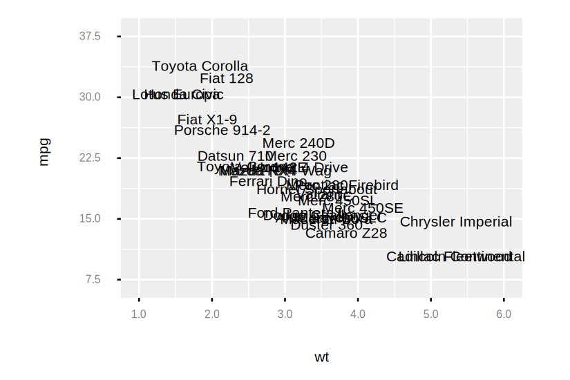
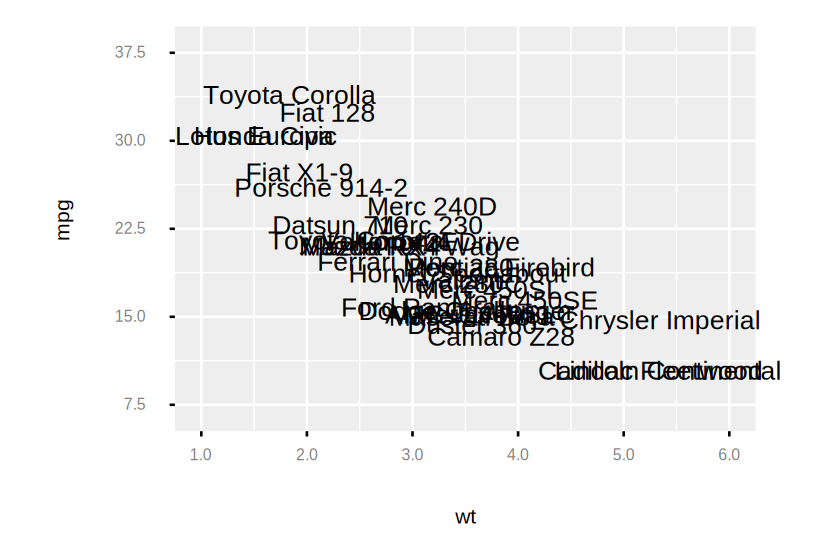
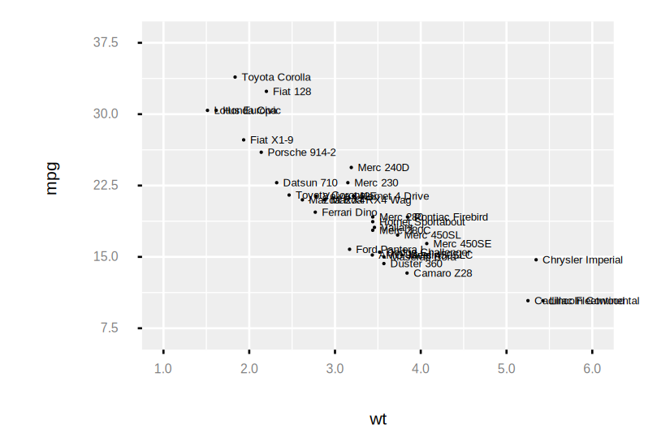
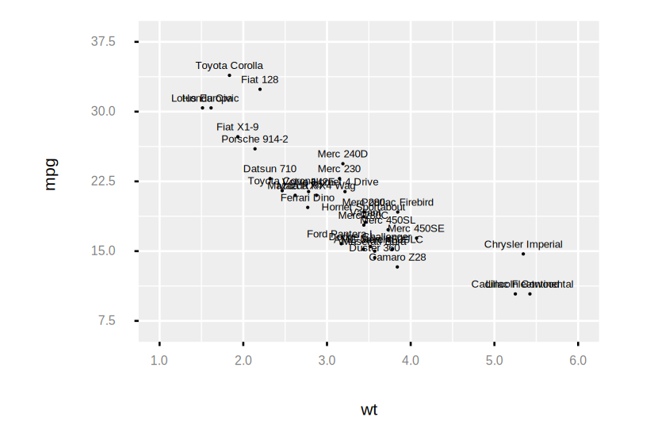
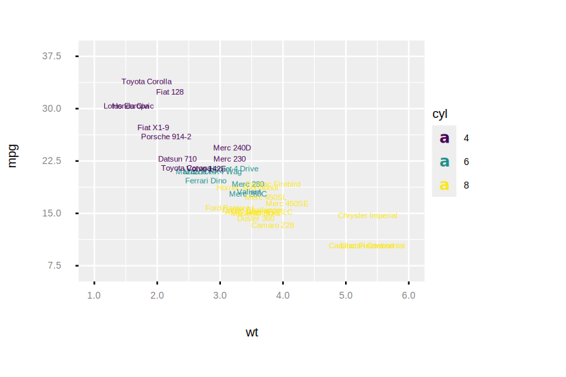
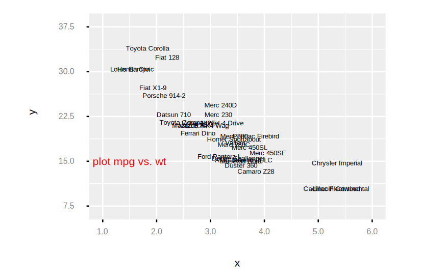
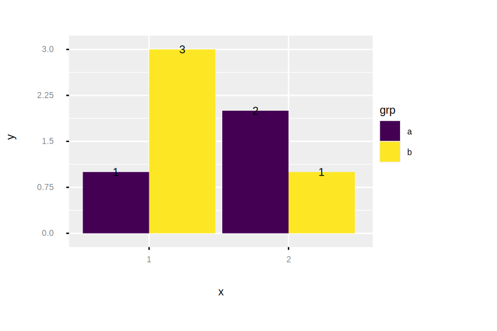
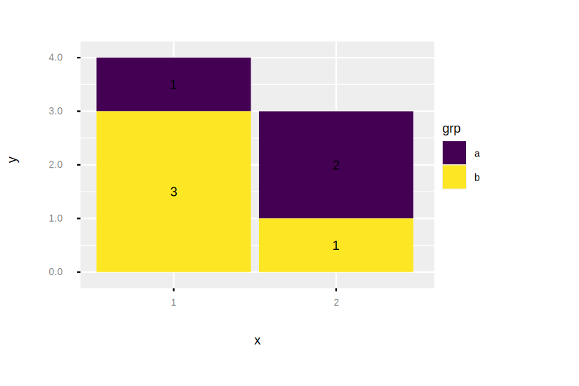

```
Examples.mtcars()
|> Plot.new(%{x: :wt, y: :mpg, label: :model})
|> Plot.geom_text()
|> Plot.plot()

```

```
# Set the font size for the label
Examples.mtcars()
|> Plot.new(%{x: :wt, y: :mpg, label: :model})
|> Plot.geom_text(size: 10)
|> Plot.plot()

```

```
# Shift positioning
Examples.mtcars()
|> Plot.new(%{x: :wt, y: :mpg, label: :model})
|> Plot.geom_point(size: 2)
|> Plot.geom_text(size: 5, hjust: :left, nudge_x: 3)
|> Plot.plot()

```

```
Examples.mtcars()
|> Plot.new(%{x: :wt, y: :mpg, label: :model})
|> Plot.geom_point(size: 2)
|> Plot.geom_text(size: 5, vjust: :top, nudge_y: 3)
|> Plot.plot()

```

```
# Map other aesthetics
Examples.mtcars()
|> Plot.new(%{x: :wt, y: :mpg, label: :model})
|> Plot.geom_text(%{color: :cyl}, size: 5)
|> Plot.plot()

```

```
# Add a text annotation
Examples.mtcars()
|> Plot.new(%{x: :wt, y: :mpg, label: :model})
|> Plot.geom_text(size: 5)
|> Plot.annotate(:text, label: "plot mpg vs. wt", x: 1.5, y: 15, size: 8, color: "red")
|> Plot.plot()

```

```
# Bar chart labelling
[%{x: "1", y: 1, grp: "a"},
  %{x: "1", y: 3, grp: "b"},
  %{x: "2", y: 2, grp: "a"},
  %{x: "2", y: 1, grp: "b"},]
|> Plot.new(%{x: "x", y: "y", group: "grp"})
|> Plot.geom_col(%{fill: "grp"}, position: :dodge)
|> Plot.geom_text(%{label: "y"}, position: :dodge, size: 6)
|> Plot.plot()

```

```
# Nudge the label up a bit
[%{x: "1", y: 1, grp: "a"},
  %{x: "1", y: 3, grp: "b"},
  %{x: "2", y: 2, grp: "a"},
  %{x: "2", y: 1, grp: "b"},]
|> Plot.new(%{x: "x", y: "y", group: "grp"})
|> Plot.geom_col(%{fill: "grp"}, position: :dodge)
|> Plot.geom_text(%{label: "y"}, position: :dodge, size: 6, nudge_y: 4)
|> Plot.plot()

```

```
# Position label in the middle of stacked bars
[%{x: "1", y: 1, grp: "a"},
  %{x: "1", y: 3, grp: "b"},
  %{x: "2", y: 2, grp: "a"},
  %{x: "2", y: 1, grp: "b"},]
|> Plot.new(%{x: "x", y: "y", group: "grp"})
|> Plot.geom_col(%{fill: "grp"})
|> Plot.geom_text(%{label: "y"}, position: :stack, position_vjust: 0.5, size: 6)
|> Plot.plot()

```

