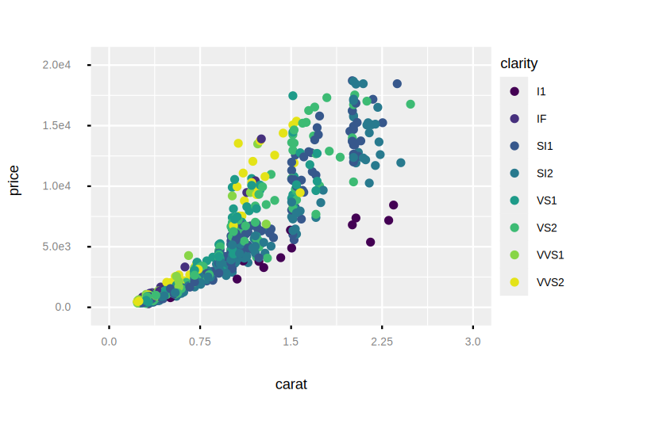
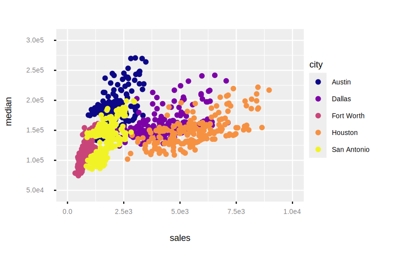
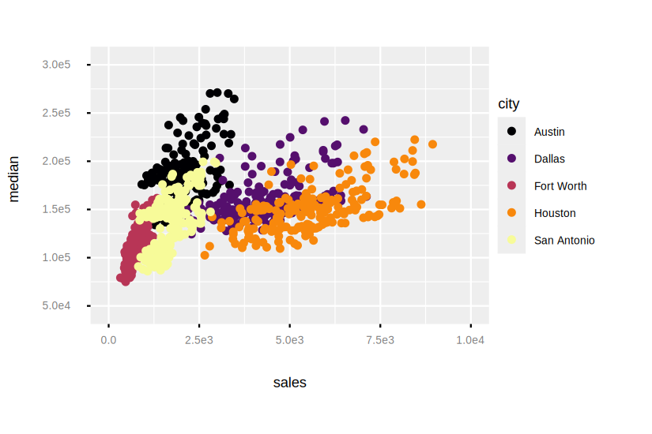

```
# The viridis scale is the default color scale
Examples.diamonds()
|> Enum.take_random(1000)
|> Plot.new(%{x: "carat", y: "price"})
|> Plot.geom_point(%{color: "clarity"})
|> Plot.plot()

```

```
# Use the :option option to select a palette
Examples.tx_housing()
|> Enum.filter(fn row -> row["city"] in
    [
      "Houston",
      "Fort Worth",
      "San Antonio",
      "Dallas",
      "Austin"
    ] end)
|> Plot.new(%{x: "sales", y: "median"})
|> Plot.geom_point(%{color: "city"})
|> Plot.scale_color_viridis(option: :plasma)
|> Plot.plot()

```

```
Examples.tx_housing()
|> Enum.filter(fn row -> row["city"] in
    [
      "Houston",
      "Fort Worth",
      "San Antonio",
      "Dallas",
      "Austin"
    ] end)
|> Plot.new(%{x: "sales", y: "median"})
|> Plot.geom_point(%{color: "city"})
|> Plot.scale_color_viridis(option: :inferno)
|> Plot.plot()

```

