```
Examples.mtcars()
|> Plot.new(%{x: :wt, y: :mpg})
|> Plot.geom_point()
|> Plot.labs(title: "Fuel economy declines as weight decreases")
|> Plot.plot()

```
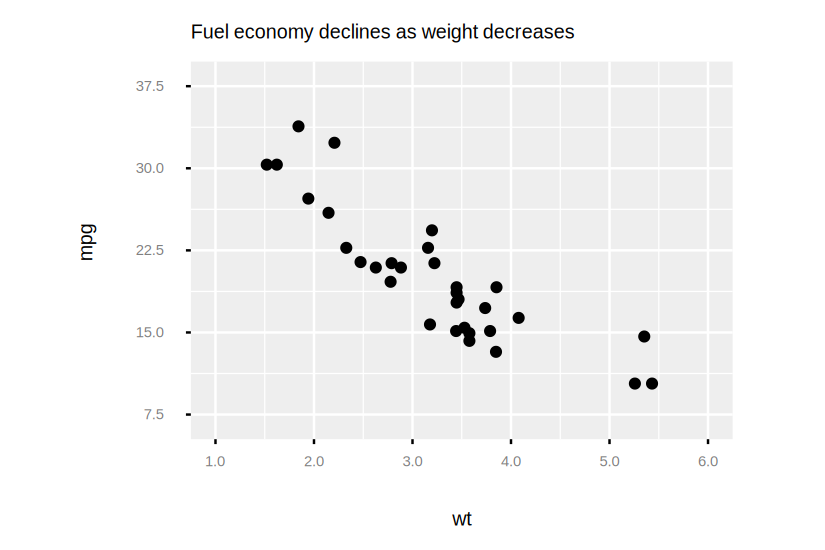
```
# Examples below assume that element constructors are imported
# e.g. `import GGity.Element.{Line, Rect, Text}

# Plot formatting
Examples.mtcars()
|> Plot.new(%{x: :wt, y: :mpg})
|> Plot.geom_point()
|> Plot.labs(title: "Fuel economy declines as weight decreases")
|> Plot.theme(plot_title: element_text(size: 10))
|> Plot.plot()

```

```
Examples.mtcars()
|> Plot.new(%{x: :wt, y: :mpg})
|> Plot.geom_point()
|> Plot.labs(title: "Fuel economy declines as weight decreases")
|> Plot.theme(plot_background: element_rect(fill: "green"))
|> Plot.plot()

```
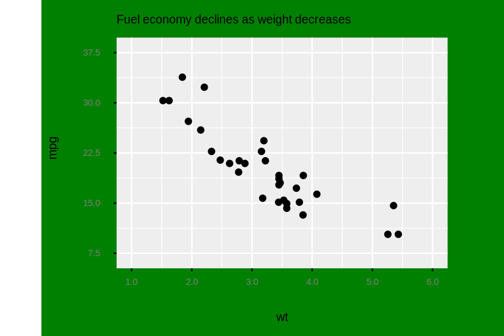
```
# Panel formatting
Examples.mtcars()
|> Plot.new(%{x: :wt, y: :mpg})
|> Plot.geom_point()
|> Plot.labs(title: "Fuel economy declines as weight decreases")
|> Plot.theme(panel_background: element_rect(fill: "white", color: "grey"))
|> Plot.plot()

```
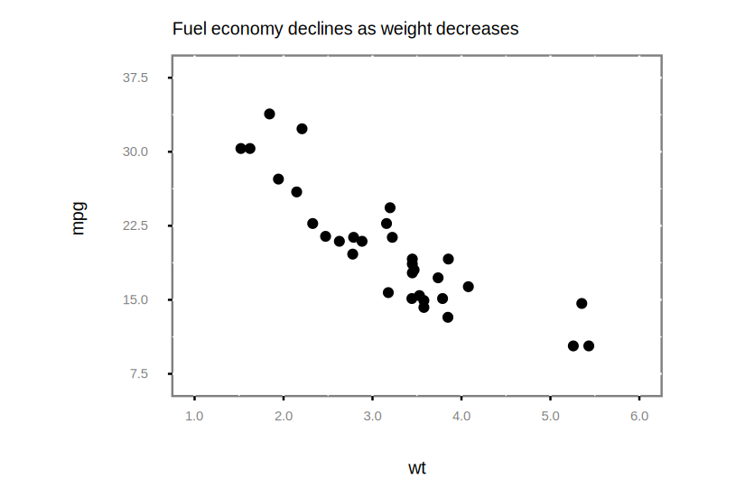
```
Examples.mtcars()
|> Plot.new(%{x: :wt, y: :mpg})
|> Plot.geom_point()
|> Plot.labs(title: "Fuel economy declines as weight decreases")
|> Plot.theme(panel_grid_major: element_line(color: "black"))
|> Plot.plot()

```
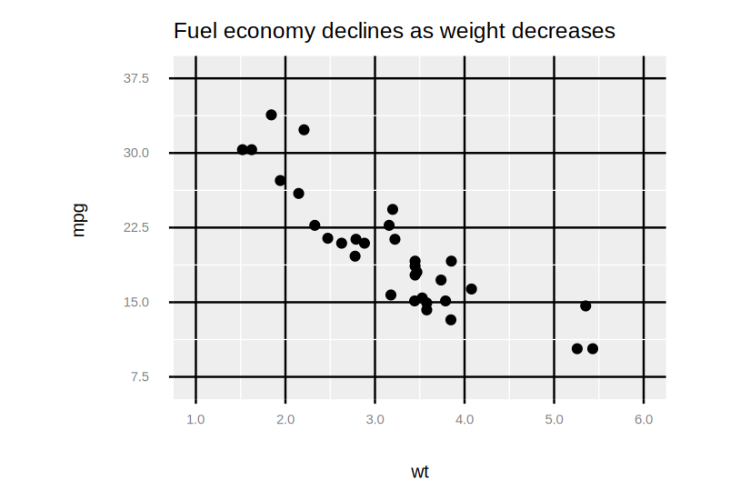
```
# Axis formatting
Examples.mtcars()
|> Plot.new(%{x: :wt, y: :mpg})
|> Plot.geom_point()
|> Plot.labs(title: "Fuel economy declines as weight decreases")
|> Plot.theme(axis_line: element_line(size: 6, color: "grey"))
|> Plot.plot()

```
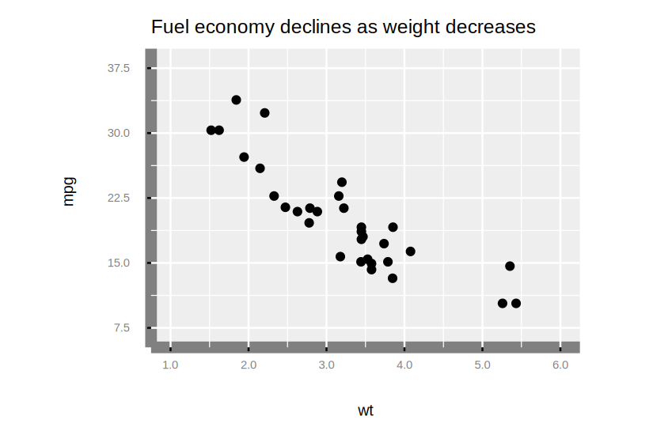
```
Examples.mtcars()
|> Plot.new(%{x: :wt, y: :mpg})
|> Plot.geom_point()
|> Plot.labs(title: "Fuel economy declines as weight decreases")
|> Plot.theme(axis_text: element_text(color: "blue"))
|> Plot.plot()

```
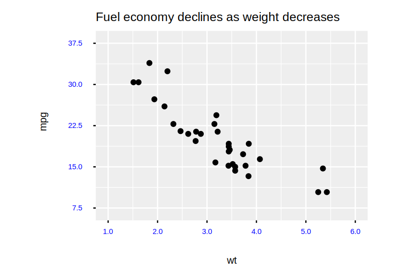
```
Examples.mtcars()
|> Plot.new(%{x: :wt, y: :mpg})
|> Plot.geom_point()
|> Plot.labs(title: "Fuel economy declines as weight decreases")
|> Plot.theme(axis_ticks: element_line(size: 4))
|> Plot.plot()

```
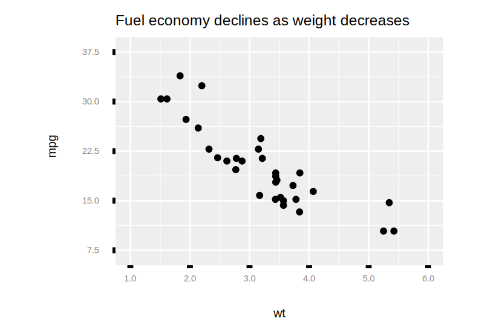
```
# Turn the x-axis ticks inward
Examples.mtcars()
|> Plot.new(%{x: :wt, y: :mpg})
|> Plot.geom_point()
|> Plot.labs(title: "Fuel economy declines as weight decreases")
|> Plot.theme(axis_ticks_length_x: -2)
|> Plot.plot()

```
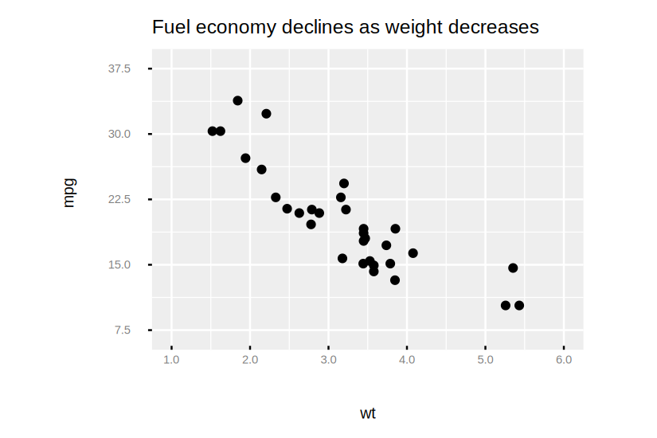
```
# GGity does not support legend position, but legend key boxes
# and text can be styled as you would expect

# Default styling
Examples.mtcars()
|> Plot.new(%{x: :wt, y: :mpg})
|> Plot.geom_point(%{color: :cyl, shape: :vs})
|> Plot.labs(
  x: "Weight (1000 lbs)",
  y: "Fuel economy (mpg)",
  color: "Cylinders",
  shape: "Transmission"
  )
|> Plot.plot()

```
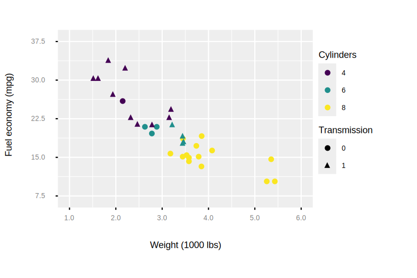
```
# Style legend keys
Examples.mtcars()
|> Plot.new(%{x: :wt, y: :mpg})
|> Plot.geom_point(%{color: :cyl, shape: :vs})
|> Plot.labs(
  x: "Weight (1000 lbs)",
  y: "Fuel economy (mpg)",
  color: "Cylinders",
  shape: "Transmission"
  )
|> Plot.theme(legend_key: element_rect(fill: "white", color: "black"))
|> Plot.plot()

```
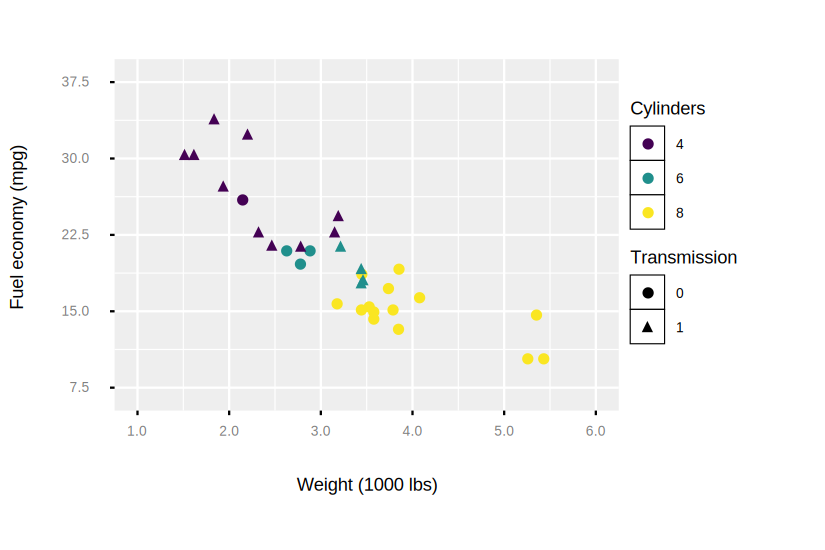
```
# Style legend text
Examples.mtcars()
|> Plot.new(%{x: :wt, y: :mpg})
|> Plot.geom_point(%{color: :cyl, shape: :vs})
|> Plot.labs(
  x: "Weight (1000 lbs)",
  y: "Fuel economy (mpg)",
  color: "Cylinders",
  shape: "Transmission"
  )
|> Plot.theme(legend_text: element_text(size: 4, color: "red"))
|> Plot.plot()

```
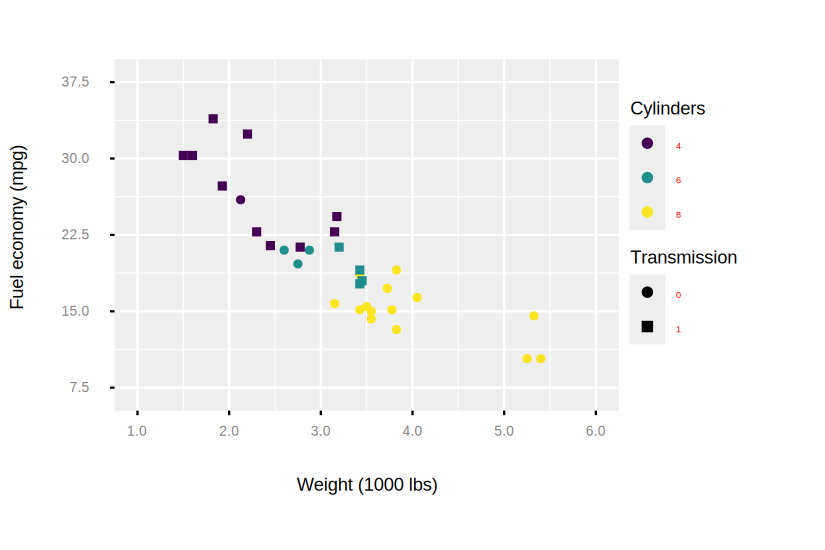
```
# Style legend title
Examples.mtcars()
|> Plot.new(%{x: :wt, y: :mpg})
|> Plot.geom_point(%{color: :cyl, shape: :vs})
|> Plot.labs(
  x: "Weight (1000 lbs)",
  y: "Fuel economy (mpg)",
  color: "Cylinders",
  shape: "Transmission"
  )
|> Plot.theme(legend_title: element_text(face: "bold"))
|> Plot.plot()

```
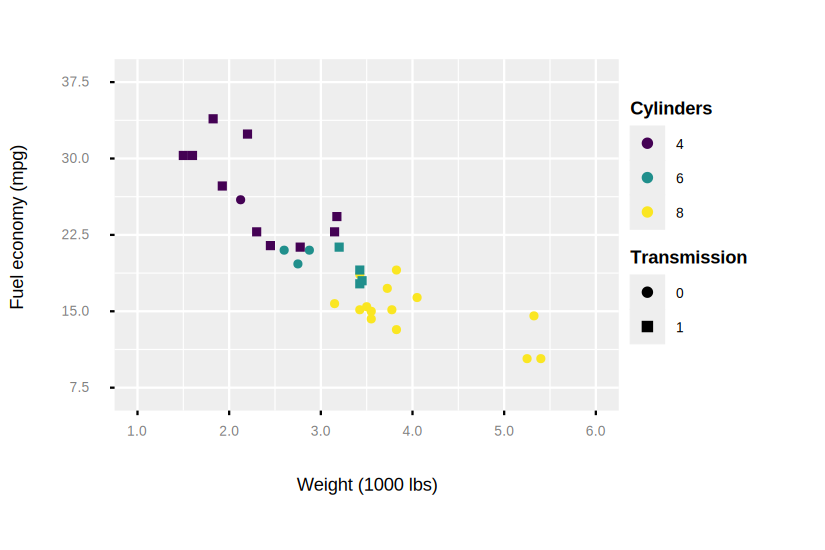
